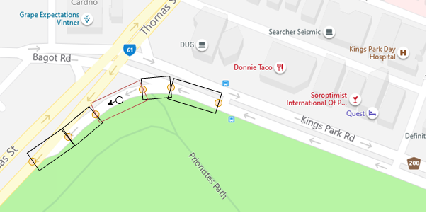
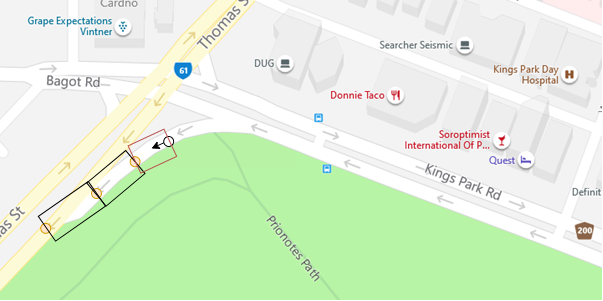

# Motorist app

The aim of this application is to help users (specifically motorists) to be more aware and mindful of cyclists in surroundings. The application will retrieve telemetry of cyclists from the web services. The telemetry will be used to determine potential hazards and alert the user.

# How to run

1. Install Android Studio
2. Install node.js
3. Run `npm install` in the project root
4. Open Android Studio
5. Go to Device Manager and create an emulator (Tested on Google Pixel 3a, Android 10)
6. Run the emulator
7. Run `npm run android` in the project root

# Installing Alert Package
## Npm install
Requires SSH keys to automatically download and install
* If an access error occurs or ssh keys are not set up then manually download and install the alert package
## Manual Download
Download the package from [alert-system](https://github.com/Expektus/alert-system) link, then follow the installation guide to install the package

# Building APK
Follow the following instructions to build the android APK, commands assume in the root mobile-motorist directory
```
mkdir android/app/src/main/assets
```
Bundle up the assets
```
react-native bundle --platform android --dev false --entry-file index.js --bundle-output android/app/src/main/assets/index.android.bundle
```
Build the apk
```
cd android
// Windows
gradlew assembleRelease
// Linux/Mac
./gradlew assembleRelease
```
APK is saved to
```
android/app/build/outputs/apk/app-release.apk
```

## Potential Build Errors
### Duplicate assets:
* Delete the duplicate assets
```
cd android/app/src/main/res
rm -rf drawable*
rm -rf raw
```
# Changelog

1. (15/10/2020) - Fixed the heading (direction) inconsistency and jumps, seems to be stable now.
2. (15/10/2020) - Added the google sign in stuff from cyc app, to allow more ppl to test (Clash of telemetry will occur if > 1 ppl use testMotor)
3. (15/10/2020) - Can do limited/fixed zoom in/out now, `double tap screen to zoom out` and `long press to zoom in`. Might be helpful when observing/testing routing functionality.

# Routing Algorithm Details
1. Select a subsection of the start of the route, as the likelihood that a motorist will be contained within an edge decreases the further along the route the edge is, assuming the route is being updated regularly.
2.	For each edge within the selected subsection, convert the edge from two nodes into a rectangle that has the same orientation.
3.	Check if the motorist GPS position falls within the corresponding rectangle of one of the subsection edge.
4.	If so compare the  orientation of the corresponding edge with the motorists orientation.  If the difference between these two orientations is below a certain threshold the motorist is determined to be within the route, and also following it. 

5.	Update the route so that the firsts edge is the edge that contains the motorist, and that the first node of this edge, is the motorist’s current position.   

6.	Now replace the old subsection that was at the front of the route, with the updated subsection.  If throughout the above process, the motorist is not found within an edge, or is found within an edge, but has a orientation that is deemed to be significantly different, then request the Bing Maps API and generate a new route.
